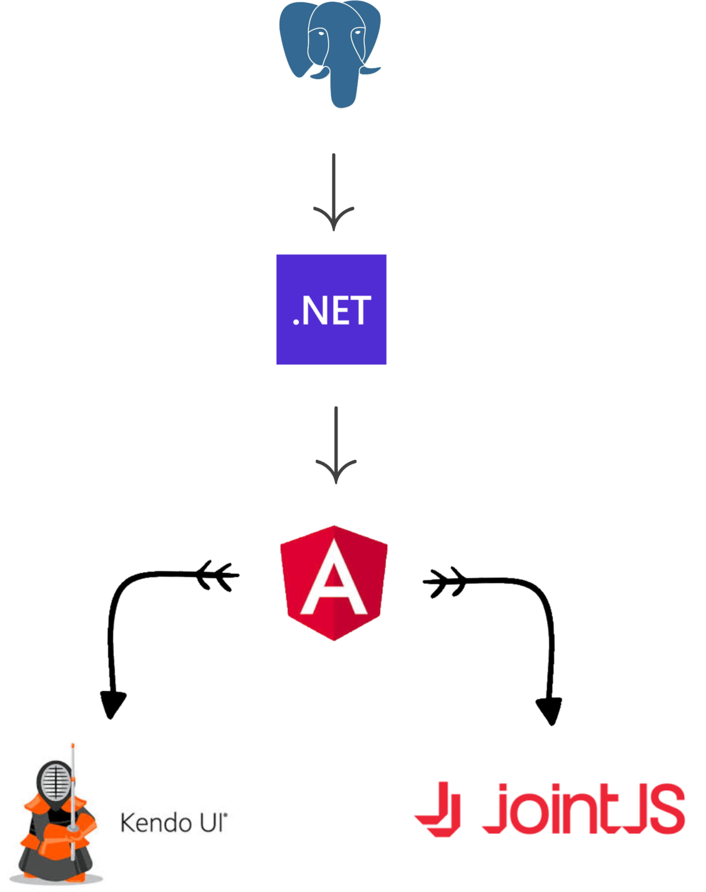

I'm a passionate **Full-Stack Software Developer** with over 4 years of experience building enterprise applications using modern technologies. I specialize in **.NET backends**, **Angular frontends**, and **cloud deployments**.

  

## About Me

I'm currently a Full-Stack Software Developer at **Red Cedar Technology Group**, where I work on mission-critical applications for government clients. My expertise spans the full development stack, from database design to user interfaces, with a focus on clean architecture and modern development practices.

**Key Highlights:**
- 🏛️ **Secret Clearance** with US Government & **CompTIA Security+** certified
- 🚀 Led migration of 100+ MySQL functions to Entity Framework
- ☁️ Experienced with **Azure**, **DoD Cloud**, and on-premise deployments
- 📱 Expert in modern **Angular** with **RXJS**, **NGRX**, and **Signals**
- 🏗️ Passionate about **Clean Architecture** and **REST APIs**

---

## Technical Skills

### Proficient Technologies
**Languages & Frameworks:** C#, JavaScript, SQL, Angular, .NET, HTML, CSS  
**Libraries & Tools:** Entity Framework, RXJS, NGRX, Git  
**Architecture:** SysML, BPMN, REST APIs, Clean Architecture

### Familiar Technologies
**Cloud & DevOps:** Python, Azure, Microsoft MSAL Auth  
**Databases:** PostgreSQL, Microsoft SQL Server, MySQL

---

## Professional Experience

### 🔹 Full-Stack Software Developer
**Red Cedar Technology Group** • *April 2022 – Present*

- **Enterprise Migration:** Led refactoring of 100+ MySQL functions to Entity Framework for improved maintainability
- **Cloud Migration:** Assisted in migrating full on-premise application to DoD cloud provider, including complete authentication system rewrite
- **Frontend Modernization:** Currently rewriting legacy Razor pages to modern Angular frontend using RXJS and NGRX
- **Angular Innovation:** Refactored NGRX stores to leverage Angular's new Signal framework for better performance
- **Backend Architecture:** Create new .NET functionality with REST APIs following Clean Architecture principles

### 🔹 Consulting/Freelance Developer
**Independent** • *October 2024 – January 2025*

- **Healthcare Web App:** Built comprehensive patient management system for Edwardsville healthcare business
- **Full-Stack Solution:** Microsoft SQL Server database, .NET backend, Angular frontend
- **Azure Deployment:** Deployed as bundled App Service on Azure with Microsoft MSAL authentication
- **Business Impact:** Streamlined patient record management and medication refill scheduling

### 🔹 Software Developer
**US Steel** • *June 2020 – April 2022*

- **Mainframe Development:** Debugged COBOL and JCL programs on IBM mainframe systems
- **Database Applications:** Created and maintained COBOL and .NET applications with Toad SQL databases
- **Global Impact:** Applications deployed across all US Steel plants globally
- **Process Leadership:** Managed Quality and Standardization procedures for 5 development teams

---

## Featured Projects

### 🏗️ Consolidated Architecture Tool Suite (CATS)
*Enterprise Architecture Platform for DoD*

A comprehensive business architecture platform serving Air Force, Army, and US Transportation Command. Features include:
- **.NET 8 REST APIs** with **PostgreSQL** database
- **Angular + Razor** hybrid frontend with custom authorization
- **BPMN & SysML** diagramming using Joint JS library
- **DoD Cloud** hosting with enterprise-grade security

*CATS Architecture Diagram - Enterprise system design and visualization platform*

**Impact:** Empowers architects to design and visualize complex military systems

### 🏢 Company Portal
*Internal Business Process Automation*

Leading a team of 3 junior developers to maintain critical business automation platform:
- **Document Management** with Azurite integration for scalability
- **Training System** with custom E-signature functionality
- **Quality Management System** supporting CMMI and ISO processes
- **NGRX State Management** for complex frontend workflows

### 🏛️ MODOC Domicile
*Insurance Alternative Platform*

Currently developing innovative insurance solution for Modoc Nation Indian Tribe:
- **Alternative Insurance Model** replacing traditional captive insurance
- **Microsoft Identity API** integration for secure authentication
- **OpenAPI/Swagger** documentation for robust API design
- **Custom E-signature** functionality for streamlined processes

---

## Education & Certifications

**Bachelor of Science in Computer Science**  
*Southern Illinois University Edwardsville* • 2021

**Security Clearance & Certifications**
- 🔒 **Secret Clearance** - US Government
- 🛡️ **CompTIA Security+** Certification

---

## Let's Connect

I'm always interested in discussing new opportunities, sharing knowledge about modern development practices, or collaborating on exciting projects. Feel free to reach out!


